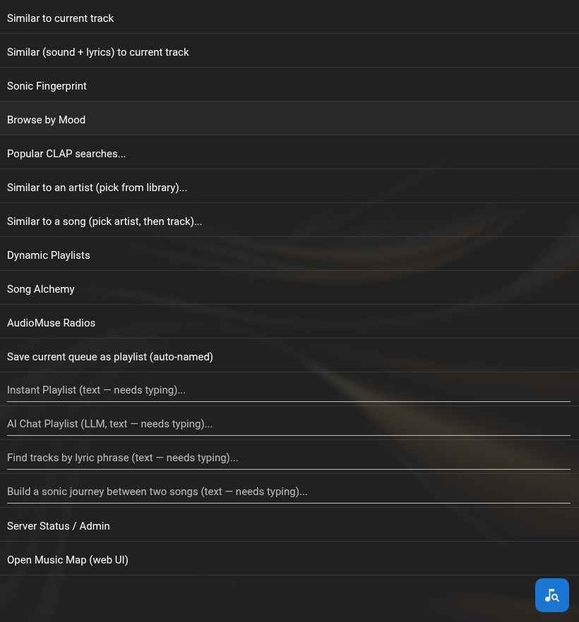

# lyrion-audiomuseai-plugin

A plugin for [Lyrion Music Server](https://lyrion.org) that brings [AudioMuse-AI's](https://github.com/NeptuneHub/AudioMuse-AI) sonic-similarity features into the standard Lyrion controllers (web UI, Material Skin, iPeng, Squeezer) — under **My Music → AudioMuse-AI**.

> You already control playback from a Lyrion controller; this plugin makes AudioMuse-AI's playlists tap-reachable from the same place, instead of a separate web UI.

Requires a running [AudioMuse-AI](https://github.com/NeptuneHub/AudioMuse-AI) instance.

## Install

1. In Lyrion: **Settings → Plugins → Additional Repositories**, paste this URL:

   ```
   https://raw.githubusercontent.com/JameZUK/lyrion-audiomuseai-plugin/main/extensions.xml
   ```

2. Apply, tick **AudioMuse-AI** in the third-party plugin list, Apply, and restart Lyrion when prompted.
3. Open **Settings → Plugins → AudioMuse-AI**, set your **Server URL** (e.g. `http://localhost:8000`) and **API token** (from the AudioMuse-AI web UI → Administration), then hit **Test connection**.

Prefer to install by hand? See [docs/TROUBLESHOOTING.md → Manual install](docs/TROUBLESHOOTING.md#manual-install).

## Features

Everything lives under **My Music → AudioMuse-AI**:

<p align="center"></p>

### Instant playlists (one tap)

- **Similar to current track** — builds a queue of songs that *sound* like whatever's playing right now.
- **Similar (sound + lyrics)** — same idea, but it also matches on **lyrics**, not just the audio — great when the *feel* of the words matters.
- **Sonic Fingerprint** — a personal mix drawn from your own listening history.
- **Browse by Mood** — tap a mood (Energetic, Calm, Happy, Sad, Aggressive, Acoustic, Party) and get a matching playlist.
- **Popular searches** — a list of community-popular prompts you can tap to try.

### Find music by artist or song

- **Similar to an artist** — search or browse your library for an artist, tap them, and get tracks by the most similar artists.
- **Similar to a song** — search for an artist, pick one of their songs, and get songs that sound like it.

(Both start with a **search box**, so you can type a name instead of scrolling.)

### Describe what you want (type it)

- **Instant Playlist** — type a vibe in plain words (*"low-energy late-night ambient"*) and get a matching queue.
- **AI Chat Playlist** — ask in natural language; your AudioMuse server's AI turns it into a playlist.
- **Lyrics search** — find songs by a lyric phrase or theme.
- **Find Path** — make a smooth, gradual transition playlist from one song to another.

> These need an on-screen keyboard, so they work on the web UI, Material, and iPeng. (Squeezer can't type — use the [context-menu shortcut](#shortcut-the-context-menu) instead.)

### Keep it going & blend

- **Don't Stop The Music** — pick an AudioMuse mode in your player's audio settings and the queue refills itself as it runs low. Three flavours: *Similar to recent tracks*, *Mix by recent album* (broader), and *Sonic fingerprint*.
- **Dynamic Playlists** — the same auto-extend, started from the plugin menu instead.
- **Song Alchemy** — blend it your way: add songs you want it to lean toward, subtract ones to avoid, then generate.
- **AudioMuse Radios** — one-tap rebuild of the saved "stations" you set up in the AudioMuse web UI.

### Save, manage & link out

- **Save current queue as a playlist** — auto-named (or type your own on web/Material).
- **Server Status / Admin** — see the current task and progress, start analysis or clustering, or cancel a running job.
- **Open Music Map** — jump to the AudioMuse-AI web map.

### Shortcut: the context menu

Browse to **any** artist, track, or album the normal way and open its context menu (right-click on the web UI, long-press or the **⋮** icon on Material, 3-dot on iPeng) — you'll find **AudioMuse: similar artists / similar tracks / similar (sound + lyrics) / alchemy from this album** right there. It's the fastest path, and the recommended one on Squeezer.

> On **Material**, these sit under **More** in the context menu — see [docs/USAGE.md](docs/USAGE.md#context-menu).

## Documentation

| Doc | Covers |
|---|---|
| **[Usage & menu reference](docs/USAGE.md)** | Every menu item, the fastest paths, per-controller behaviour, feature map. |
| **[Settings](docs/SETTINGS.md)** | All settings, auto-name strategies, Don't Stop The Music, per-player overrides. |
| **[CLI / JSON-RPC](docs/CLI.md)** | Drive every action from scripts, Home Assistant, or Material custom buttons. |
| **[Troubleshooting](docs/TROUBLESHOOTING.md)** | Common issues, limitations, manual install. |

## License

MIT — see [LICENSE](LICENSE).

## Credits

- [AudioMuse-AI](https://github.com/NeptuneHub/AudioMuse-AI) by NeptuneHub — the upstream project providing all the sonic analysis.
- [Lyrion Music Server](https://lyrion.org) — the music-server framework.
- Plugin development patterns cribbed from [AF-1's Dynamic Playlists 4](https://github.com/AF-1/lms-dynamicplaylists), a gold-standard LMS plugin.
